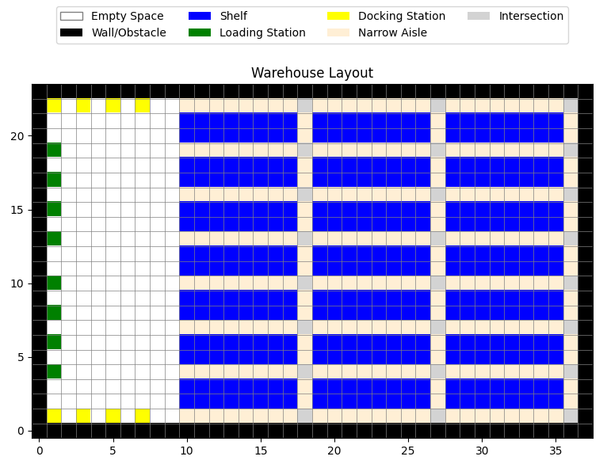
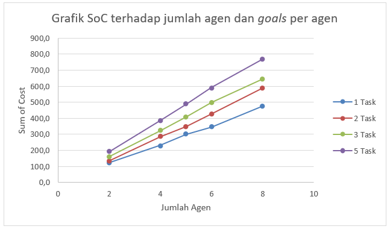
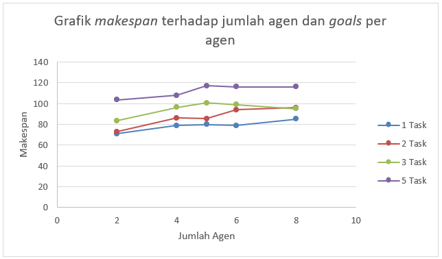
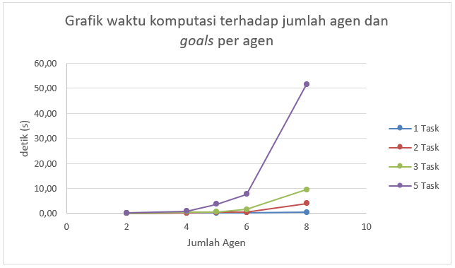
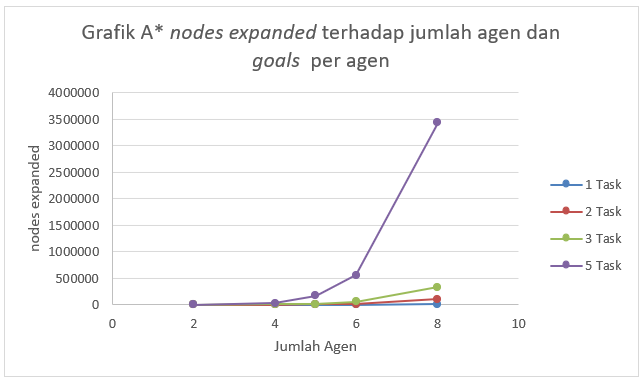
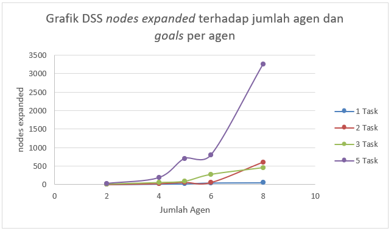
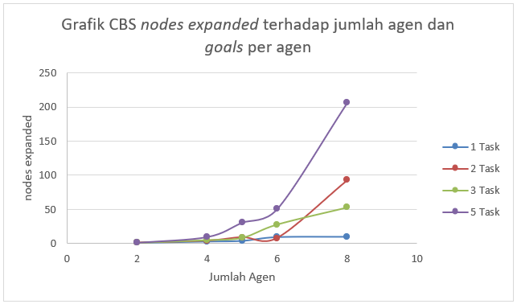

# Research Results

## Configurations
The simulation evaluated 5 agent counts ($\text{num\_agents} \in \{2, 4, 5, 6, 8\}$) across 4 goal settings per agent ($\text{goals\_per\_agent} \in \{1, 2, 3, 5\}$). With 20 iterations per combination (each iteration is a different seed, means different set of goals, starting and finish points), the experiment comprised 400 scenarios in total. These configurations run in an evaluation grid within 120 seconds max as algorithm cut-off time. The evaluation grid is as shown in the visualization below.

> **Empty Space**: passable by only 1 agent at a time. 
> **Walls**: not passable.  
> **Shelf**: not passable.  
> **Loading Stations**: passable, serves as finish node (+1 goals for every agent outside of their respectives $\text{goals\_per\_agent}$).  
> **Docking Stations**: passable, serves as starting node for every agent.  
> **Narrow Aisle**: practically the same as empty spaces, used to highlights where agents doing their tasks (a node vertically adjacent to shelf).  
> **Intersections**: practically the same as empty spaces, used to highlights where traffic bottlenecks usually happens.

## Simulation Results
### Key Findings
- Total Scenarios: 400 scenarios executed.

- Success Rate: 89.25% within the designated time limit.

- Timeouts: 43 scenarios exceeded the time limit and were flagged as "solver exceeded time limit".

- Timeout Handling: Because computation exceeded the allowed threshold, it was unknown if a solution existed; these 43 cases were classified as failures and excluded from performance calculations.

- Failure Context: Timeouts occurred exclusively in high-complexity (heavy) scenarios.

### Algorithm success rate for each scenario

| NA \ NG | 1 | 2 | 3 | 5 |
| :---: | :---: | :---: | :---: | :---: |
| **2** | 20/20 | 20/20 | 20/20 | 20/20 |
| **4** | 20/20 | 20/20 | 18/20 | 18/20 |
| **5** | 19/20 | 20/20 | 20/20 | 17/20 |
| **6** | 20/20 | 18/20 | 17/20 | 11/20 |
| **8** | 19/20 | 18/20 | 13/20 | 9/20 |

> **NA**: $\text{num\_agent}$.  
> **NG**: $\text{goals\_per\_agent}$.

### Metrics Graph
#### Sum of Cost (Average)

#### Makespan (Median)

#### Computation Time (Median)

#### Nodes Expanded (Median)

### Conclusion
- Implementation: Successfully developed a modular Python implementation of MGCBS Variant A2 for Multi-Goal MAPF (MG-MAPF) in narrow-aisle warehouse environments, combining CBS (high-level planner) with DSS and A* (low-level planners).

- Success Rate: Achieved an 89.25% success rate within the designated time limit.

- Failure Cause: Unsuccessful scenarios resulted from increased search complexity in high agent/goal counts, leading to massive search-space expansion and conflict spikes.

- Performance Impact: Higher numbers of agents and goals consistently increased sum of costs, makespan, computation time, and expanded node counts at both high and low levels.

- Bottlenecks: Warehouse layout constraints (narrow aisles) and conflict distribution heavily degraded resolution performance at the CBS level.

- Scope & Limits: Highly effective for small-to-medium scale warehouse environments, but faces scalability challenges as agent and goal counts scale up significantly.